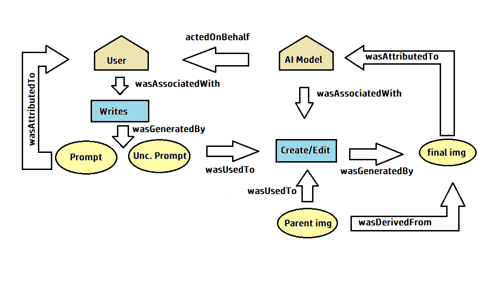

# TFM_W3C_PROV_GENAI
Software to generate provenance information for AI Generated images using W3C Schema and JUMBF Box data model. It provides information about the GenAI model used to generate the image, its version and the prompt introduced.

This is the W3C PROV schema that represents this proposal:

